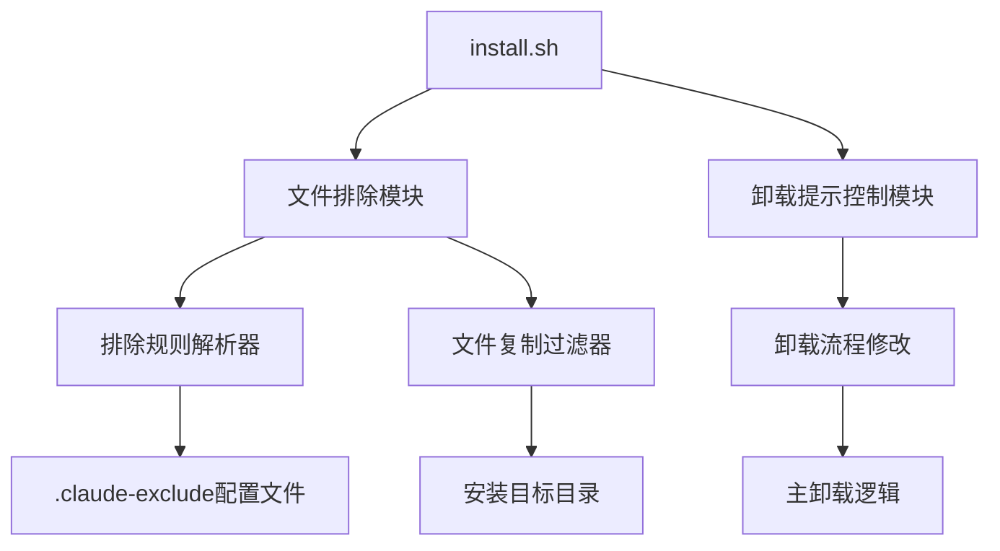

# 安装排除配置功能设计文档

## 概述
本设计文档描述了为Claude模型切换器添加文件排除功能和禁用Claude Code CLI卸载提示的技术实现方案。

## 架构设计

### 系统架构


### 模块设计

#### 1. 文件排除模块
**位置**: `install.sh` 中的 `bootstrap_install()` 函数
**职责**: 在文件复制阶段应用排除规则

**接口**:
```bash
# 检查是否启用排除功能
should_apply_exclusion_rules()

# 加载排除规则
load_exclusion_rules()

# 应用排除规则复制文件
copy_with_exclusion()
```

#### 2. 排除规则解析器
**位置**: `install.sh` 中的辅助函数
**职责**: 解析 `.claude-exclude` 配置文件

**接口**:
```bash
# 解析排除配置文件
parse_exclusion_file()

# 检查文件是否匹配排除规则
is_file_excluded()
```

#### 3. 卸载提示控制模块
**位置**: `main.sh` 中的 `cmd_uninstall()` 函数
**职责**: 禁用Claude Code CLI卸载提示

## 组件和接口

### 文件排除配置

**配置文件**: `.claude-exclude` (项目根目录)
**格式**: 每行一个规则，支持注释和通配符

**规则语法**:
- `# 注释` - 注释行
- `*.log` - 通配符匹配
- `temp/` - 目录排除
- `config/backup.*` - 模式匹配
- `!README.md` - 排除中的包含（否定规则）

### 核心函数实现

#### 排除规则解析函数
```bash
parse_exclusion_file() {
    local exclude_file="${1:-.claude-exclude}"
    local -n exclusion_rules="$2"
    
    if [ ! -f "$exclude_file" ]; then
        return 0
    fi
    
    while IFS= read -r line; do
        line=$(echo "$line" | sed 's/^[[:space:]]*//;s/[[:space:]]*$//')
        [[ -z "$line" || "$line" =~ ^# ]] && continue
        
        exclusion_rules+=("$line")
    done < "$exclude_file"
}
```

#### 文件排除检查函数
```bash
is_file_excluded() {
    local file_path="$1"
    shift
    local exclusion_rules=("$@")
    
    for rule in "${exclusion_rules[@]}"; do
        # 处理否定规则
        if [[ "$rule" == !* ]]; then
            local include_pattern="${rule:1}"
            if [[ "$file_path" == $include_pattern ]]; then
                return 1  # 包含此文件
            fi
            continue
        fi
        
        # 处理目录排除
        if [[ "$rule" == */ ]]; then
            local dir_pattern="${rule%/}"
            if [[ "$file_path" == "$dir_pattern"* ]]; then
                return 0  # 排除此文件
            fi
        fi
        
        # 处理通配符匹配
        if [[ "$file_path" == $rule ]]; then
            return 0  # 排除此文件
        fi
    done
    
    return 1  # 不排除此文件
}
```

#### 智能文件复制函数
```bash
copy_with_exclusion() {
    local source_dir="$1"
    local target_dir="$2"
    local exclusion_rules=("${@:3}")
    
    # 创建目标目录
    mkdir -p "$target_dir"
    
    # 遍历源目录
    while IFS= read -r -d '' file; do
        local relative_path="${file#$source_dir/}"
        
        if ! is_file_excluded "$relative_path" "${exclusion_rules[@]}"; then
            local target_file="$target_dir/$relative_path"
            local target_parent=$(dirname "$target_file")
            
            mkdir -p "$target_parent"
            cp -r "$file" "$target_file"
        else
            log_debug "Excluded: $relative_path"
        fi
    done < <(find "$source_dir" -type f -print0)
}
```

### 卸载提示修改

**修改位置**: `main.sh` 中的 `cmd_uninstall()` 函数

**修改内容**:
```bash
# 移除以下代码块：
echo -n "Do you want to remove Claude Code CLI as well? [y/N]: "
read -r remove_claude

case "$remove_claude" in
    [yY]|[yY][eE][sS])
        uninstall_claude_code "" "true"
        ;;
    *)
        log_info "Claude Code CLI preserved"
        ;;
esac

# 替换为：
log_info "Claude Code CLI preserved (exclusion feature disables removal prompt)"
```

## 数据模型

### 排除规则数据结构
```bash
# 排除规则数组
declare -a EXCLUSION_RULES

# 规则示例：
EXCLUSION_RULES=(
    "*.log"
    "temp/"
    "docs/"
    "!README.md"
    "config/backup.*"
)
```

### 配置环境变量
```bash
# 控制排除功能的环境变量
export CLAUDE_EXCLUDE_FILE=".claude-exclude"  # 排除配置文件路径
export IGNORE_EXCLUDE=0                       # 是否忽略排除规则
```

## 错误处理

### 排除规则错误处理
1. **配置文件不存在**: 静默跳过，使用默认行为
2. **规则语法错误**: 记录警告，跳过无效规则
3. **权限问题**: 记录错误，继续处理其他文件

### 文件复制错误处理
1. **目标目录权限不足**: 终止安装并显示错误
2. **源文件不存在**: 记录警告，继续处理
3. **磁盘空间不足**: 终止安装并显示错误

## 测试策略

### 单元测试
1. **排除规则解析测试**: 验证各种规则格式的解析
2. **文件匹配测试**: 测试文件路径与规则的匹配逻辑
3. **否定规则测试**: 验证排除中的包含逻辑

### 集成测试
1. **安装过程测试**: 验证排除功能在完整安装流程中的工作
2. **配置文件测试**: 测试不同配置文件的加载和应用
3. **错误处理测试**: 验证各种错误场景的处理

### BDD测试场景
```bash
describe "文件排除功能"
context "当存在.claude-exclude配置文件时"
it "应该在安装过程中排除指定的文件"
it "应该正确处理通配符规则"
it "应该支持目录排除"
it "应该支持否定规则"

describe "卸载提示禁用"
context "当执行卸载操作时"
it "不应该询问是否卸载Claude Code CLI"
it "应该保持Claude Code CLI的安装状态"
```

## 性能考虑

1. **规则解析性能**: 使用数组存储规则，避免重复解析
2. **文件匹配性能**: 使用高效的路径匹配算法
3. **内存使用**: 控制规则数组的大小，避免内存溢出

## 安全考虑

1. **路径遍历防护**: 验证规则不包含恶意路径
2. **权限控制**: 确保排除功能不会绕过文件权限检查
3. **配置验证**: 验证配置文件的完整性和安全性

## 向后兼容性

1. **默认行为**: 当配置文件不存在时，保持现有安装行为
2. **环境变量**: 提供 `IGNORE_EXCLUDE` 变量来禁用排除功能
3. **错误恢复**: 排除功能失败时回退到标准安装

## 部署计划

1. **第一阶段**: 实现核心排除功能
2. **第二阶段**: 添加卸载提示禁用
3. **第三阶段**: 完善测试覆盖
4. **第四阶段**: 更新文档和示例

这个设计确保了功能的完整性、安全性和可维护性，同时保持了与现有系统的兼容性。